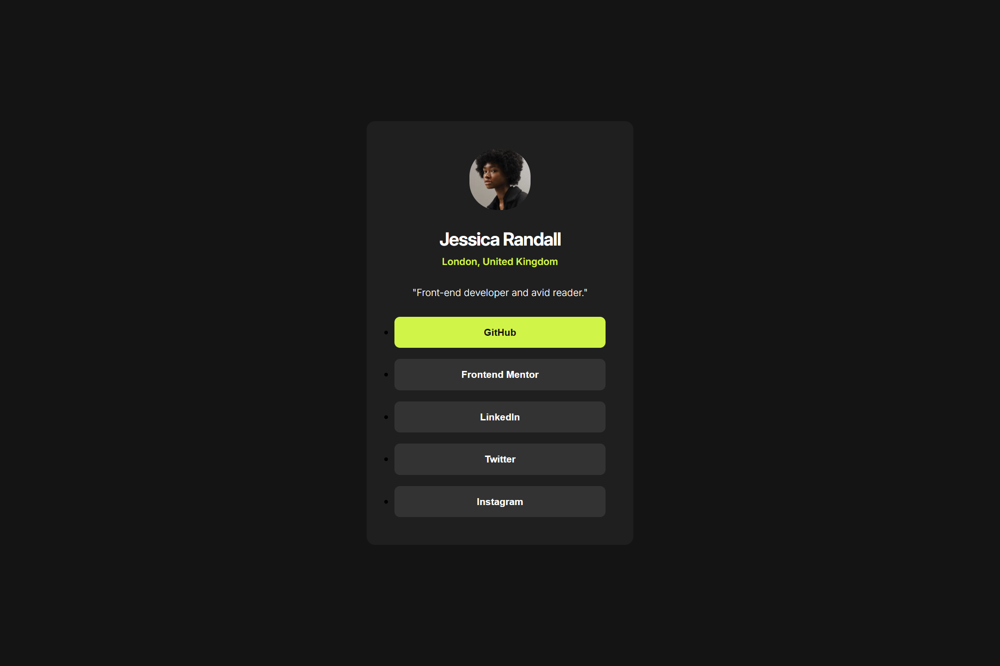

# Frontend Mentor - Social links profile solution

This is a solution to the [Social links profile challenge on Frontend Mentor](https://www.frontendmentor.io/challenges/social-links-profile-UG32l9m6dQ) 

## Overview

### Links

- Live Site URL: [Click here!](https://social-links-profile-jj.netlify.app/)

### Screenshot

### Built with

- HTML5 & CSS3

### What I learned

- Use the \<a\> tag, which supports focus and keyboard navigation (via the Tab key), combined with :focus to ensure visitors can navigate the links using only their keyboard.