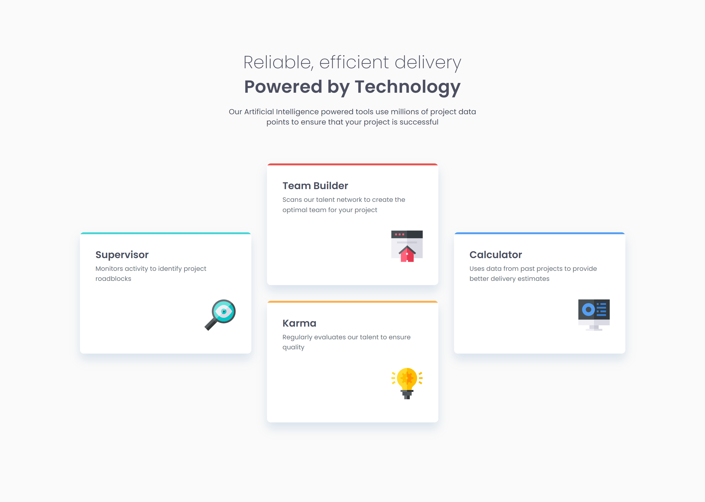

# Frontend Mentor - Four card feature section solution

This is a solution to the [Four card feature section challenge on Frontend Mentor](https://www.frontendmentor.io/challenges/four-card-feature-section-weK1eFYK).

## Overview

### Links

- Live Site URL: [Click here!](https://four-card-feature-section-jj.netlify.app/)

### Screenshot

### Built with

- HTML5
- Sass(SCSS)

### What I learned

- 
