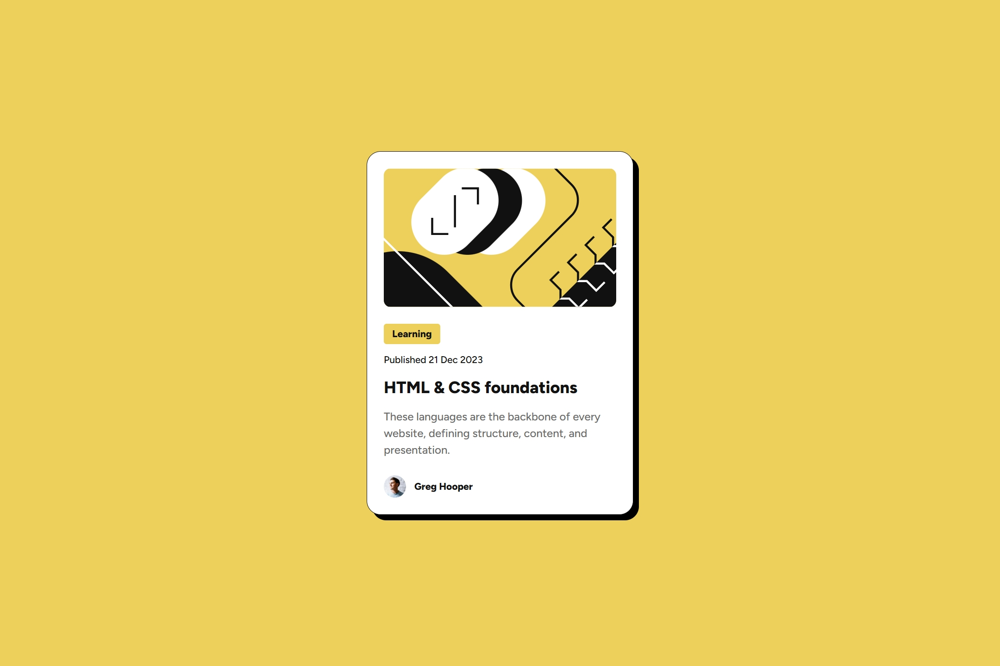

# Frontend Mentor - Blog preview card solution

This is a solution to the [Blog preview card challenge on Frontend Mentor](https://www.frontendmentor.io/challenges/blog-preview-card-ckPaj01IcS).

## Overview

### Links

- Live Site URL: [Click here!](https://blog-preview-card-jj.netlify.app/)

### Screenshot

### Built with

- HTML5 & CSS3

### What I learned

- Uses clamp() to set a scalable font size that adjusts based on the viewport width but stays within a defined range, instead of using media queries.