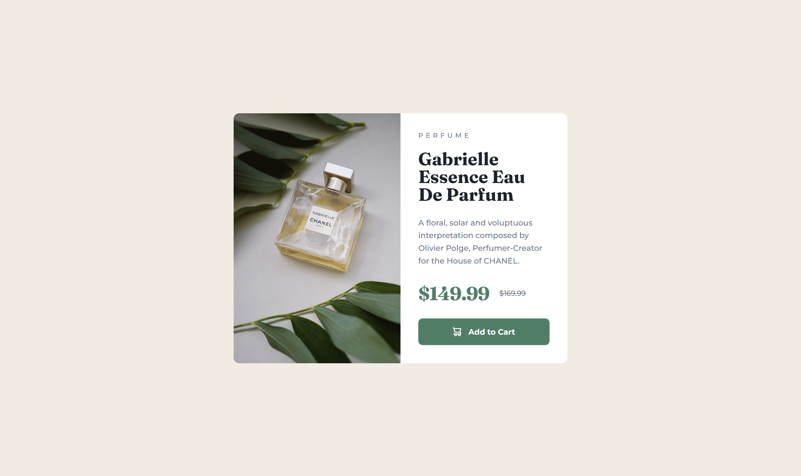

# Frontend Mentor - Product preview card component solution

This is a solution to the [Product preview card component challenge on Frontend Mentor](https://www.frontendmentor.io/challenges/product-preview-card-component-GO7UmttRfa).

## Overview

### Links

- Live Site URL: [Click here!](https://product-preview-card-component-jj.netlify.app/)

### Screenshot

### Built with

- HTML5
- Sass(SCSS)

### What I learned

- I learned how to use Sass to organize styles more efficiently compared to writing raw CSS. By utilizing variables, nesting, and other features, Sass enhances code readability, reduces repetition, and improves maintainability, making the stylesheet easier to manage.
- I implemented the\<picture\> element to serve different images based on screen size (desktop vs. mobile). This helps improve performance by delivering optimized images for different devices, ensuring faster load times and a better user experience across various screen resolutions.