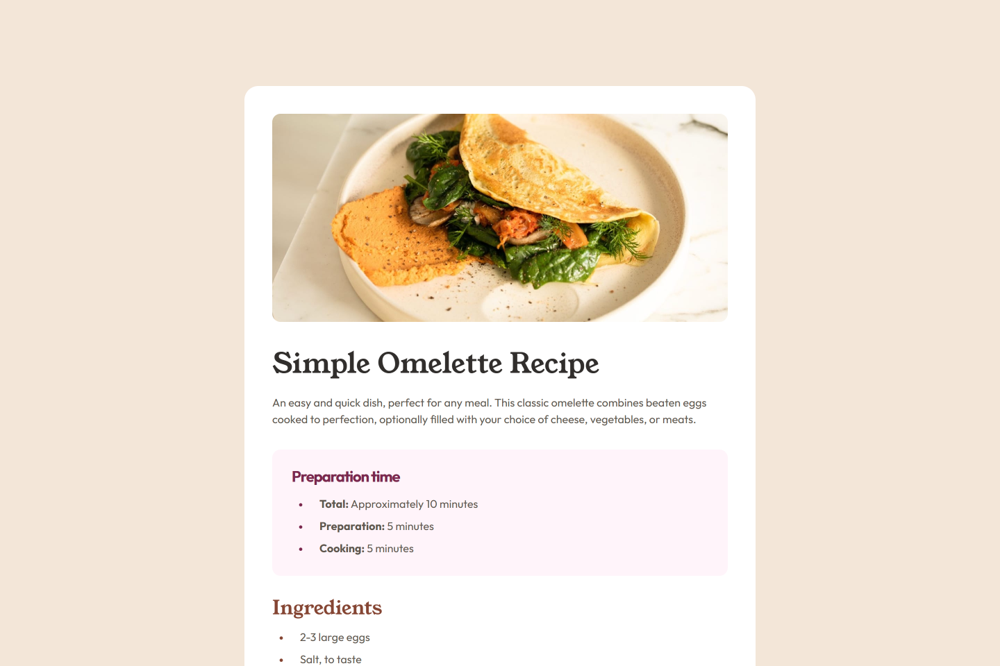

# Frontend Mentor - Recipe page solution

This is a solution to the [Recipe page challenge on Frontend Mentor](https://www.frontendmentor.io/challenges/recipe-page-KiTsR8QQKm).

## Overview

### Links

- Live Site URL: [Click here!](https://recipe-page-jj.netlify.app/)

### Screenshot

### Built with

- HTML5 & CSS3

### What I learned

- Utilizes CSS variables to define colors, spacing, border-radius, and typography. This improves code maintainability and reusability by avoiding hardcoded values and ensuring consistency across styles.